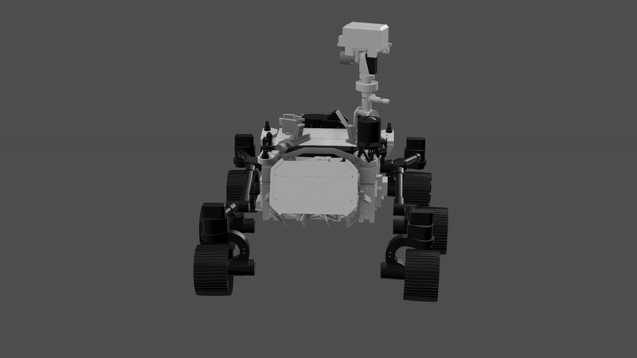

## 3D designs remarks
This [Fusion360 design file](RC_touchscreen_cases_Spektrum_DX8.f3d) contains the cases for the custom remote control PCB module and ESP32S3-8048 touchscreen. These cases adapt to the shape of the Spektrum DX8 remote, allowing to place the custom RC module and touchscreen as add-ons. 

The case for the ESP32S3-8048 touchscreen is a modified version of this [case design](https://www.thingiverse.com/thing:6517481) found on Thingiverse.

The original design of the Mars rover model can be found on this [Cults3D page](https://cults3d.com/en/3d-model/game/mars-rover-perseverance-replica-howtomechatronics). The original design of the robotic arm can be found in this [GitHub page](https://github.com/jakkra/Mars-Rover). 

Lots of modifications were made to the original Mars rover and robotic arm designs. The Fusion360 design file containing all the modified parts will be added here in the coming weeks. 

## 3D designs images

### Modified DIY Perseverance Rover Replica design
  

    
  

### Original (left) and modified (right) robotic arm design

### Remote control and touchscreen cases design
