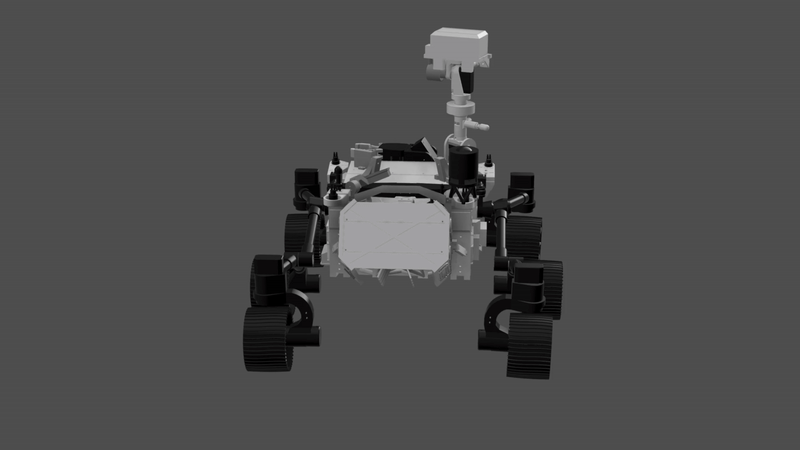

## 3D designs remarks

The original 3D design of the Mars rover model can be found in this [Cults3D page](https://cults3d.com/en/3d-model/game/mars-rover-perseverance-replica-howtomechatronics). The original 3D design of the robotic arm can be found in this [GitHub page](https://github.com/jakkra/Mars-Rover). Lots of modifications were made to these designs, which were originally created by Dejan (HowToMechatronics) and Jakob Krantz respectively.

Since the original design of the Mars rover is not free (it has to be purchased via the Cults3D page provided before) only the parts of the rover that were created from scratch are present in the [rover Fusion360 design file](rover_modified_and_new_parts.f3d) of this folder. Since the original design of the robotic arm is open-source, the [rover Fusion360 design file](rover_modified_and_new_parts.f3d) contains the parts of the robotic arm that were either created from scratch, modified or original. 

For the remote control and touchscreen module, there are two different 3D designs depending on the selected option:

1) Custom remote control PCB: This [Fusion360 design file](rc-pcb-spacers-and-touchscreen-case.f3d) contains the spacers that hold the acrylic plates and PCB together, the structure that holds the touchscreen, and the case for the ESP32S3-8048 touchscreen.

2) Generic/commercial remote control attachment: The cases for the home-made PCB (of the "Arduino Nano" submodule) and for the ESP32S3-8048 touchscreen are in this [Fusion360 design file](rc_and_touchscreen_cases-spektrum_dx8.f3d). These cases adapt to the shape of the Spektrum DX8 remote, allowing to place the home-made PCB and touchscreen as an attachment. 

The case for the ESP32S3-8048 touchscreen is a modified version of this [case design](https://www.thingiverse.com/thing:6517481) found on Thingiverse.

## 3D designs images

### DIY Perseverance Rover Replica design with some new and modified parts
  

    
  

### Original (left) and modified (right) robotic arm design

### Spacers, touchscreen case, and structure design for the custom remote control PCB 

### Attachment cases design for the generic/commercial remote control 
