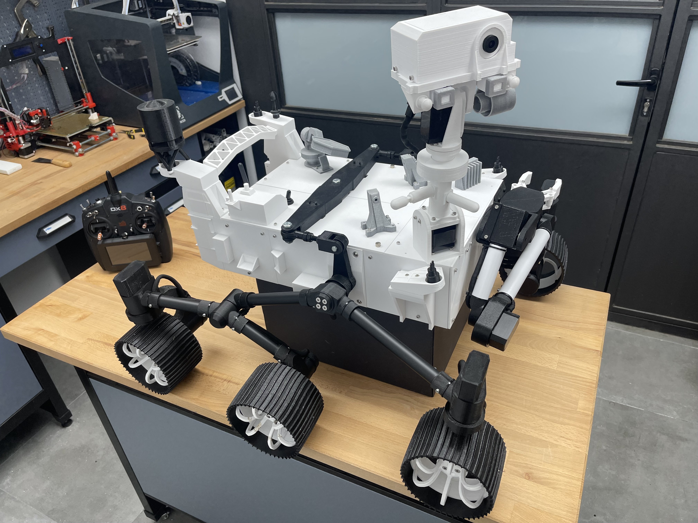
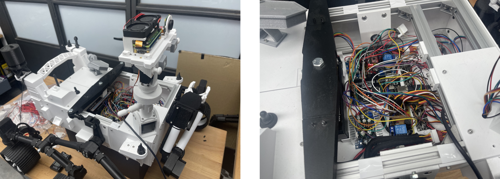
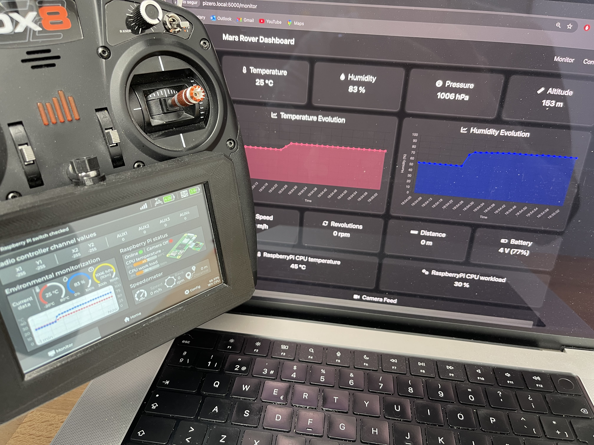
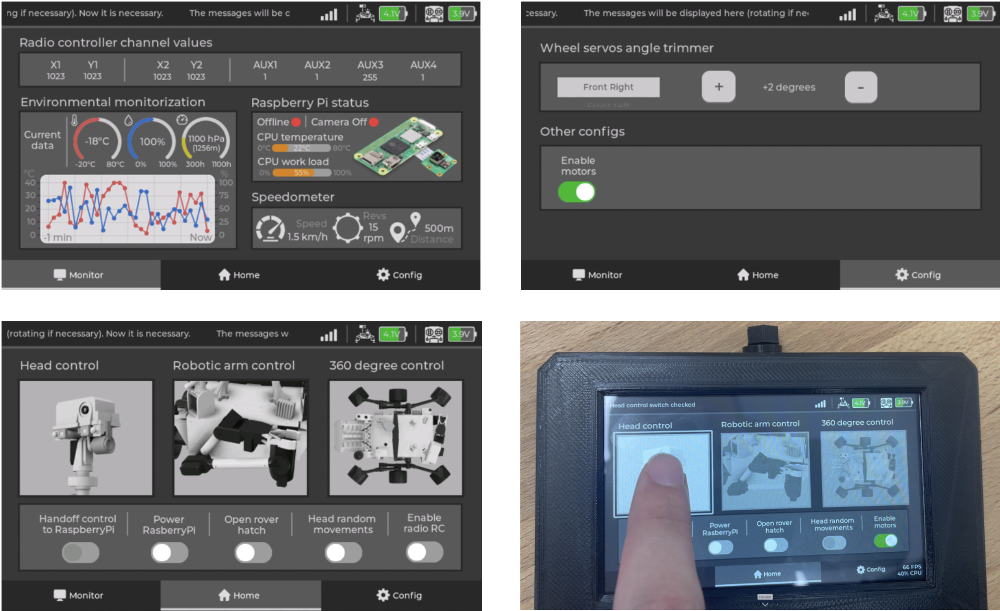
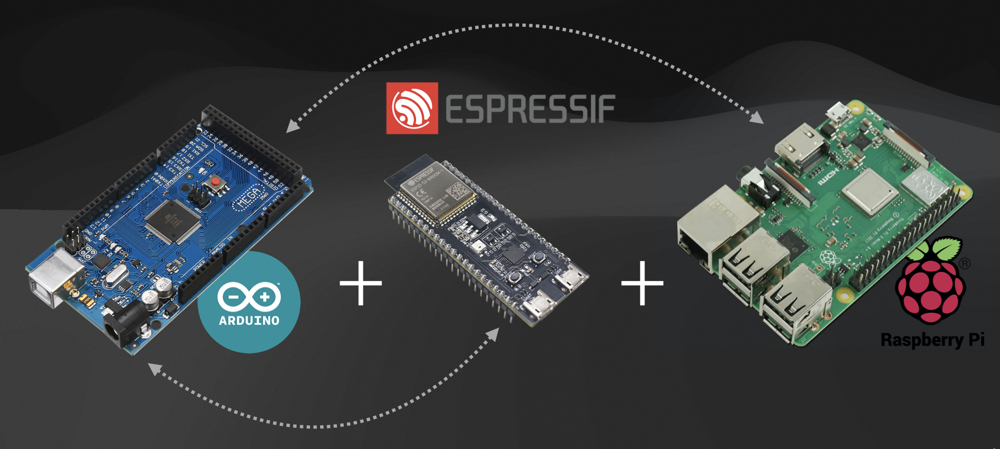
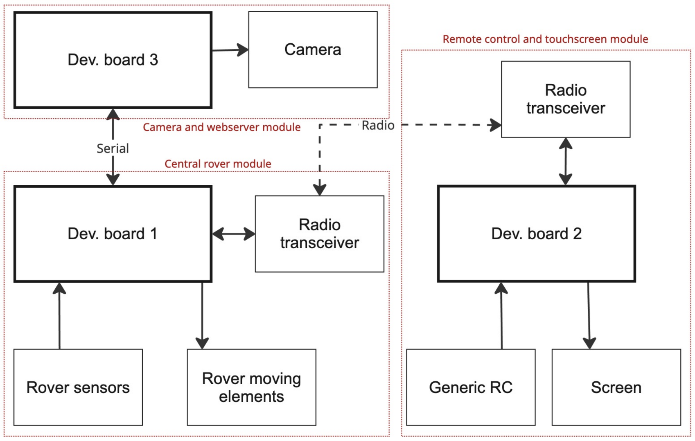
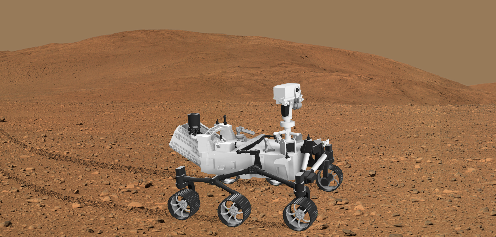

# OpenRover robotic platform

## General project overview

### Context
Rovers are planetary surface exploration robots that space agencies like NASA send to Mars in order to explore and collect information that will be sent back to Earth. In this project, a functional 3D printed replica of the "Perseverance" rover, which was launched by NASA in July 2020, is created. 

The project was developed as part of my final computer engineering degree project. Therefore, in addition to the documentation provided in the repository’s READMEs, you can find a comprehensive [project report](project_report/openrover_project_report.pdf) containing theoretical explanations, design decisions, and technical implementation details.

### Objective
The main objective of the OpenRover project is to develop an open-source robotic platform that can enable anyone who tries building it to learn more about both the software and hardware aspects of DIY robotic projects, specially learning about widely used development boards like Arduino, ESP32 and Raspberry Pi.  

As rovers are extremely sophisticated machines, they provide the perfect excuse to incorporate into the robotic platform several complex functionalities that replicate, at a smaller scale, the functionalities that real Mars rovers have (e.g., robotic arm, environmental sensors, 6-wheel drive).  

### Key contributions
Although many open-source robotic projects already exist, even some also related to Mars rover robots, they usually only use a single type of development board. In the OpenRover project, partly due to its complexity and wide scope, several development boards are used among its main functional modules (e.g., RaspberryPi for web connectivity, ESP32 for embedded screen, Arduino for motor control) and there are interactions between these modules. 

This adds more educational value to the project, allowing to see each development board optimal usecase, and differentiates the OpenRover from other open-source DIY robotic projects. 

### Tech stack

#### Programming languages and frameworks

 

#### Other technologies

To program Arduino and ESP32 microcontrollers, the PlatformIO IDE with the Arduino Framework was used. To create the embedded UI design of the touchscreen, the SquareLine Studio platform and LVGL library were used.

### Disclaimers
The rover's 3D design was originally made by a mechatronics engineer called Dejan, who owns an educational YouTube channel and website called "HowToMechatronics". This design was adapted and improved. 

**[Link to the original project used for the rover's 3D design](https://howtomechatronics.com/projects/diy-mars-perseverance-rover-replica-with-arduino/)**

The robotic arm's 3D design was extracted from a GitHub project made by Jakob Krantz, who also created a Mars rover replica. This design was adapted and improved. 

**[Link to the original project used for the robotic arm's 3D design](https://github.com/jakkra/Mars-Rover)**

All the OpenRover hardware and software was created from scratch, following a different approach from the one the creators of the original 3D designs followed. 

## Features

The OpenRover platform offers an interesting set of functionalities:

- 6-wheel drive platform with 4 steerable wheels
- 4-axis foldable robotic arm with gripper
- Tiltable and rotary head, with space for a development board and a camera
- Environmental sensors to measure temperature, humidity, pressure and altitude
- Custom remote control module with touchscreen, with a UI where status values are displayed and different operation modes can be selected
- Battery sensors for the rover and the custom remote control
- 4 main operation modes: conventional driving control, 360º turn control, robotic arm control, head control
- Web dashboard that displays status values and a video feed. This web dashboard is hosted in the rover

## Project modules
The OpenRover's components are organized, both at a hardware and software level, in different modules:

- Central rover module: It has an Arduino Mega development board that is inside the main body of the rover and that manages all moving elements (e.g., motors, servomotors) as well as the rover's sensors and sending/receiving the radio signal

- Remote control and touchscreen module: It has an ESP32S3 development board that is responsible for the touchscreen, and an Arduino Nano that is responsible for reading the RC channel values, sending/receiving the radio signal and measuring battery levels

- Camera and webserver module: It has a RaspberryPi Zero 2W development board that is inside the head of the rover. This board connects to a camera, generates a WiFi network and hosts a web dashboard

### Remarks
This repository contains the code and documentation of all the modules. However, the codebase is actually distributed across different repositories:

- The folder ``camera_and_webserver_module/raspberrypi_code/`` contains the [openrover-web-dashboard](https://github.com/pol-valero/openrover-web-dashboard.git) repository. 

- The folder ``central_rover_module/arduino_mega_code/`` contains the [openrover-central-controller](https://github.com/pol-valero/openrover-central-controller) repository. 

- The folder ``remote_control_and_touchscreen_module/arduino_nano_code/`` contains the [openrover-rc-transmitter](https://github.com/pol-valero/openrover-rc-transmitter) repository. 

- The folder ``remote_control_and_touchscreen_module/esp32s3_code/`` contains the [openrover-rc-touchscreen](https://github.com/pol-valero/openrover-rc-touchscreen.git) repository. 

- The folder ``remote_control_and_touchscreen_module/touchscreen_ui_design_squareline/`` contains the [openrover-touchscreen-ui-design](https://github.com/pol-valero/openrover-touchscreen-ui-design.git) repository. 

"Git subtrees" were used to link these independent repositories to folders inside this central [openrover-robotic-platform](https://github.com/pol-valero/openrover-robotic-platform) repository. 

## Expected build time
The build time can vary a lot depending on skill level and number of tools available. Experienced builders can expect to assemble the mechanical platform in approximately 60 hours and implement all the wiring and hardware in approximately 80 hours. 

Although the exact number of 3D printing hours was not recorded, it is estimated that it took approximately 400 hours to 3D print all the rover’s components. This number can vary a lot depending on the 3D printer model and the desired 3D printing quality.

## Getting started steps
- Step 1: Order all the mechanical and hardware parts. A list with the most important parts is provided in the [hardware components](hardware_components/) folder. For the mechanical platform, a parts list is also provided in the [original project used for the mechanical design](https://howtomechatronics.com/projects/diy-mars-perseverance-rover-replica-with-arduino/) 

- Step 2: 3D print the parts of the mechanical platform that are present in the 3D design files that can be found on the Cults3d page of the [original project mechanical design](https://cults3d.com/en/3d-model/game/mars-rover-perseverance-replica-howtomechatronics). Inside the [3D designs](3d_designs/) folder there are some other custom 3D designs (e.g., remote control cases)

- Step 3: Assemble the mechanical platform by joining the different 3D printed parts with the other mechanical parts (e.g., pvc tubes, aluminium profiles). A detailed guide for the mechanical assembly process is available in the [original project used for the mechanical design](https://howtomechatronics.com/projects/diy-mars-perseverance-rover-replica-with-arduino/). Images showing how the OpenRover modified design was assembled are present in the README of the [assembly folder](assembly/)

- Step 4: Create the wiring connections for the hardware components (e.g., motors, servomotors) and between the hardware electronics (e.g., Arduino Mega, motor drivers). In each of the OpenRover's modules folders ([central rover](central_rover_module/), [remote control and touchscreen](remote_control_and_touchscreen_module/), and [camera and webserver](camera_and_webserver_module/)), schematics of the wiring connections are found. Images showing the soldering of various boards, the creation of electrical connections, and the placement of hardware components can be found in the README of the [assembly folder](assembly/)

- Step 5: Set up and upload the code to the development boards. In each of the OpenRover's modules folders ([central rover](central_rover_module/), [remote control and touchscreen](remote_control_and_touchscreen_module/), and [camera and webserver](camera_and_webserver_module/)), an additional README file details the necessary steps for getting all the OpenRover's software up and running for the module

## Demos
| |  |
| -------------------------- | ---------------------- |
|  |  |
|  |  |

### Longer demo video
Here is a longer demo video where some of the possible movements can be seen: https://www.youtube.com/watch?v=uD4_qy3aUkQ

Preview of demo video at 2x speed: 

### More images
On the [sciencefairs and makerfaires images](images/sciencefairs_and_makerfaires_images/) folder, there are some more images of the rover in action as well as an image detailing how the rover can be disassembled for easier transport. 

## Take it to the next level
Now it is your time to build upon the OpenRover platform. One of the cores ideas behind OpenRover is that people who replicate the project are able to modify and improve the platform, as it is designed to be very modular and extensible, specially on the software related side. 

You can add your own upgrades to the robot, integrating new components and developing additional features. 

Here are some ideas to spark inspiration for expanding OpenRover's functionalities:

- Rover control from the web dashboard (e.g., using draggable joysticks), which currently is only used for monitoring and displaying video feed

- Adding computer vision using the existing RaspberryPi camera and RaspberryPi Zero 2W board. Computer vision could be used to navigate autonomously or to track objects with the rover's tiltable and rotary head

- Ability to record movements for the robotic arm, allowing it to automatically fold and unfold or perform a certain procedure

- From the hardware schematic designs, design PCB boards that can be manufactured. These boards would be very useful to make the hardware connections more compact and to allow an easier replication of the project

 

## Licensing
Licensed under [MIT License](LICENSE.txt)