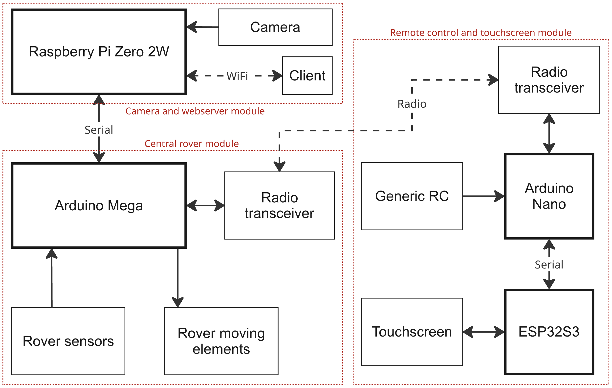

# OpenRover robotic platform


## General project overview

### Context
Rovers are planetary surface exploration robots that space agencies like NASA send to Mars in order to explore and collect information that will be sent back to Earth. 

### Motivations
The OpenRover project originates from a personal hobby project in which, using an existing 3D design of a Mars rover replica found online, the design has been adapted, improved, 3D printed and assembled at home. The final 3D printed result has the functional structure and appearance of the "Perseverance" rover, which was launched by NASA in July 2020, and landed on Mars in February 2021.

### Objective
The main objective of the OpenRover project is to develop an open-source robotic platform that can enable anyone who tries building it to learn more about both the software and hardware aspects of DIY robotic projects, specially learning about widely used development boards like Arduino, ESP32 and Raspberry Pi.  

As rovers are extremely sophisticated machines, they provide the perfect excuse to incorporate into the robotic platform several complex functionalities that replicate, at a smaller scale, the functionalities that real Mars rovers have (e.g., robotic arm, environmental sensors, 6-wheel drive).  

### Key contributions
Although many open-source robotic projects already exist, even some also related to Mars rover robots, they usually only use a single type of development board. In the OpenRover project, partly due to its complexity and wide scope, several development boards are used among its main functional modules (e.g., RaspberryPi for web connectivity, ESP32 for embedded screen, Arduino for motor control) and there are interactions between these modules. 

This adds more educational value to the project, allowing to see each development board optimal usecase, and differentiates the OpenRover from other open-source DIY robotic projects. 

### Disclaimers
The mechanical platform design was originally made by a mechatronics engineer called Dejan, who owns an educational YouTube channel and website called "HowToMechatronics". This design was adapted and improved. 

**[Link to the original project used for the mechanical design](https://howtomechatronics.com/projects/diy-mars-perseverance-rover-replica-with-arduino/)**

All the OpenRover hardware and software was created from scratch, following a different approach from the one the original creator of the mechanical platform followed. 

## Features

The OpenRover platform offers an interesting set of functionalities:

- 6-wheel drive platform with 4 steerable wheels
- 4-axis foldable robotic arm with gripper
- Tiltable and rotary head, with space for a development board and a camera
- Environmental sensors to measure temperature, humidity, pressure and altitude
- Custom remote control module with touchscreen, with a UI where status values are displayed and different operation modes can be selected
- Battery sensors for the rover and the custom remote control
- 4 main operation modes: conventional driving control, 360º turn control, robotic arm control, head control
- Web dashboard where status values are displayed and a camera feed is available. This web dashboard is hosted in the rover

## Project modules
The OpenRover's components are organized, both at a hardware and software level, in different modules:

- Central rover module: It has an Arduino Mega development board that is inside the main body of the rover and that manages all moving elements (e.g., motors, servomotors) as well as the rover's sensors and sending/receiving the radio signal

- Remote control and touchscreen module: It has an ESP32S3 development board that is responsible for the touchscreen, reading the RC channel values and sending/receiving the radio signal

- Camera and webserver module: It has a RaspberryPi Zero 2W development board that is inside the head of the rover and that is able to use a camera, as well as generating a WiFi and hosting a website




## Expected build time
The build time can vary a lot depending on skill level and number of tools available. Experienced builders can expect to assemble the mechanical platform in approximately 60 hours and implement all the wiring and hardware in approximately 80 hours. 

## Getting started steps
- Step 1: Order all the mechanical, hardware and wiring parts. An [Excel file](main_parts_list/main_materials_and_parts_list.xlsx) with the most important components is provided, with the orientative price of each component. For the mechanical platform, a parts list is also provided in the [original project used for the mechanical design](https://howtomechatronics.com/projects/diy-mars-perseverance-rover-replica-with-arduino/) 

- Step 2: 3D print the parts that are present in the Fusion360 3D design files. Inside the [3D designs](3d_designs/) folder there is a design file for each of the project's modules. 

- Step 3: Assemble the mechanical platform by joining the different 3D printed parts with the other mechanical parts (e.g., pvc tubes, aluminium profiles). A detailed guide for the mechanical assembly process is available in the [original project used for the mechanical design](https://howtomechatronics.com/projects/diy-mars-perseverance-rover-replica-with-arduino/), and images of how the OpenRover modified design was assembled are present in the [images folder](images/)

- Step 4: W

## Take it to the next level
Now it is your time to build upon the OpenRover platform. One of the cores ideas behind OpenRover is that people who replicate the project are able to modify and improve the platform, as it is designed to be very modular and extensible, specially on the software related side. 

You can add your own upgrades to the robot, integrating new components and developing additional features. 

Here are some ideas to spark inspiration for expanding OpenRover's functionalities:

- Rover control from the web dashboard (e.g., using draggable joysticks), which currently is only used for monitoring and displaying video feed

- Adding computer vision using the existing RaspberryPi camera and RaspberryPi Zero 2W board. Computer vision could be used to navigate autonomously or to track objects with the rover's tiltable and rotary head

- Ability to record movements for the robotic arm, allowing it to automatically fold and unfold or perform a certain procedure

- From the hardware schematic designs, design PCB boards that can be manufactured. These boards would be very useful to make the hardware connections more compact and to allow an easier replication of the project


## How to contribute
Contributions from other developers, hobbyists and any robotics enthusiast in general are welcomed. Whether it's fixing bugs, improving documentation, expanding functionalities or simply sharing new ideas, the help is appreciated. 

### Contributions guide

- Step 1: Fork the repository by clicking the "Fork" button at the top-right section of the OpenRover GitHub repository. This will allow you to create your own copy of the repository

- Step 2: Clone the fork to your computer, so that your repository is available locally 

  ```git ```

  ```cd ```


## Licensing
