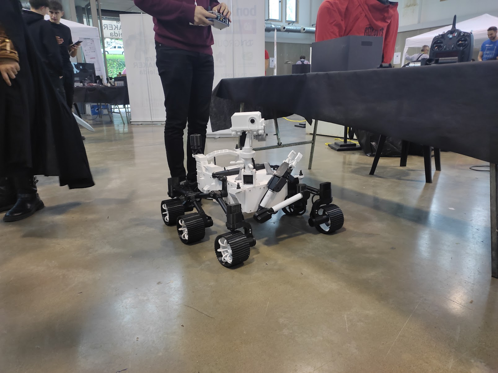
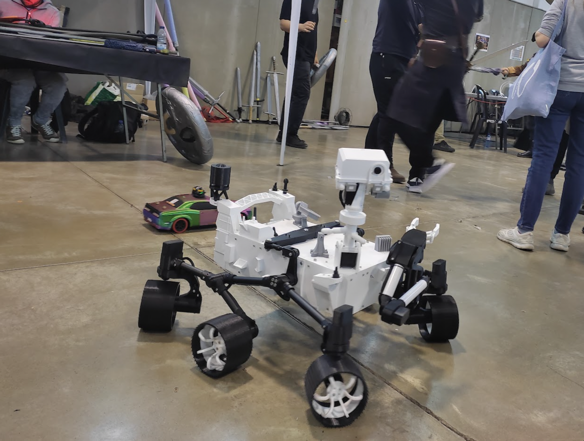
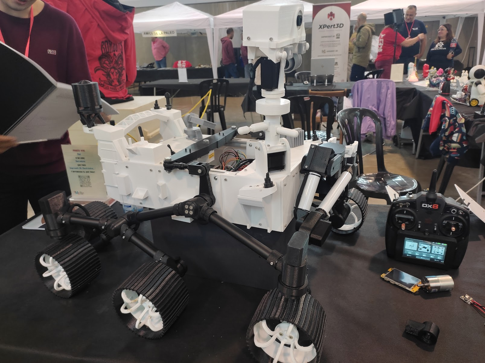
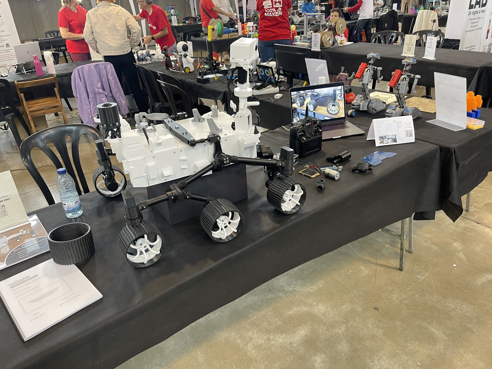
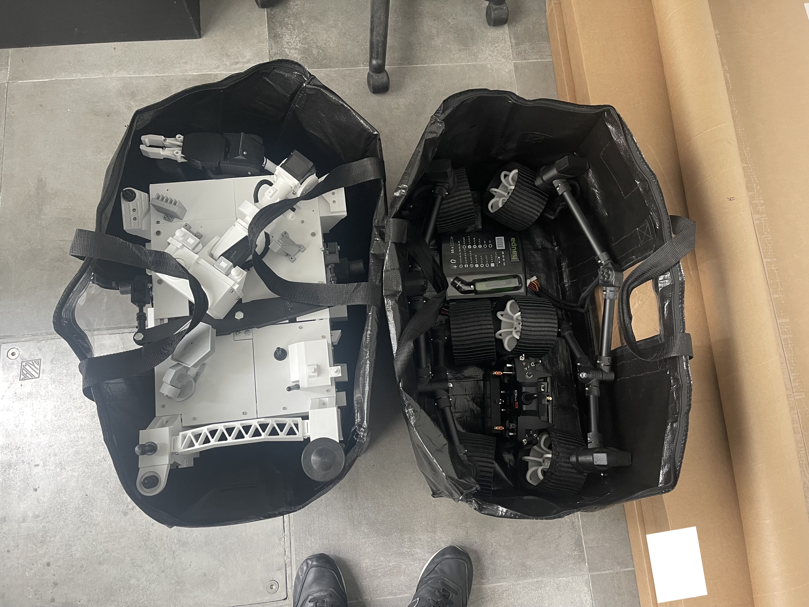

# Science fairs and makerfaires
Since this project was completed, I have attended several science fairs in Spain, where I have presented the project with the main aim of showing people how current manufacturing and prototyping techniques (e.g. 3D printing) and common development boards (e.g. Arduino, ESP32) can enable us to create almost anything we can imagine.

## Makerfaire 2025 at Lleida (Barcelona)

